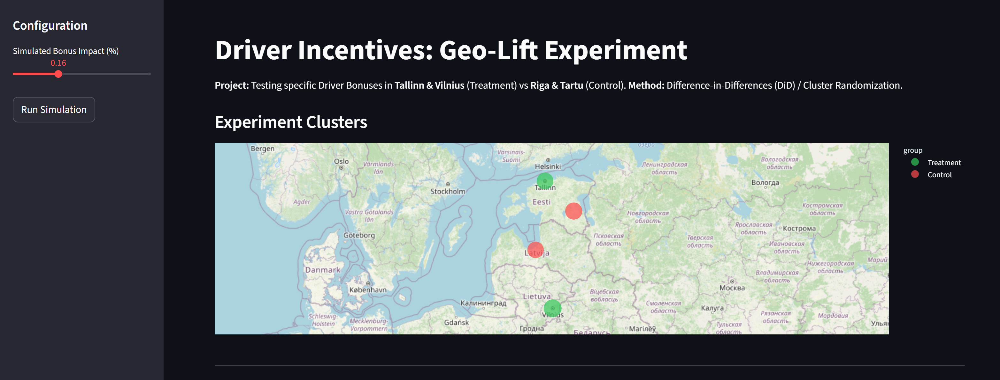
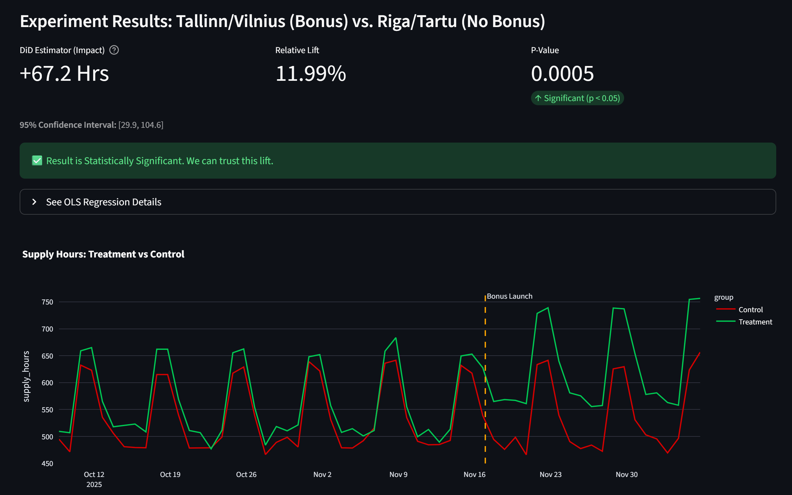

🌍 Geo-Lift Driver Incentives: Cluster Randomization
[Click to visit Live App:](https://geo-lift-driver-incentive-experiment-g4x7j4dvpa6qwwxcc8zpnw.streamlit.app/) 

Figure 1: Placebo Test Validation

Figure 2: Difference-in-Differences Analysis (Parallel Trends)

📌 Project Overview

This project demonstrates how to run experimentation in a Two-Sided Marketplace when individual user randomization is impossible due to Network Interference.

The Problem: Why not User-Level A/B?

If we give a "Bonus" to Driver A in a city but not Driver B:

Driver A works more and takes all the rides.

Driver B gets fewer rides because of Driver A.

The Control Group (Driver B) is negatively impacted, making the Treatment look better than it actually is (Spillover Bias).

The Solution: Geo-Lift (Cluster Randomization)

We randomize by City.

Treatment: Tallinn, Vilnius (Drivers get Bonus)

Control: Riga, Tartu (No Bonus)

Method: We use Difference-in-Differences (DiD) to calculate the lift. We compare the change in Driver Hours in Treatment cities vs. the change in Control cities.

🛠️ Tech Stack

Language: Python 3.9+

Backend: FastAPI (Simulation of 4 cities & DiD Calc)

Frontend: Streamlit + Plotly (Map visualizations)

Analysis: Causal Inference (DiD Estimator)

🚀 How to Run Locally

1. Setup Environment

python -m venv venv
# Windows:
.\venv\Scripts\activate
# Mac/Linux:
source venv/bin/activate

2. Install Dependencies

pip install -r requirements.txt

3. Run the Backend (Port 8001)

uvicorn backend.main:app --reload --port 8001

4. Run the Frontend

streamlit run frontend/app.py

📊 Key Concepts

Parallel Trends Assumption: The assumption that without the bonus, Treatment and Control cities would have moved in parallel. Validated by the pre-experiment data in the line chart.

DiD Estimator: (Treatment_Post - Treatment_Pre) - (Control_Post - Control_Pre).